# 🏥 IUO PCF Clinic Management System

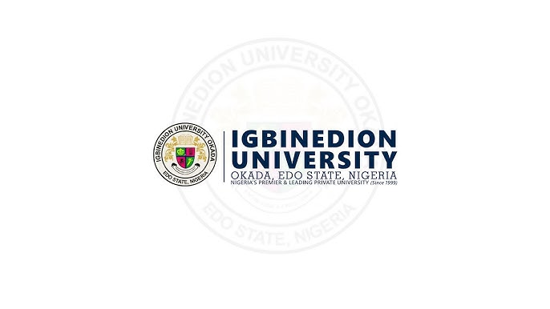

### ⚠️ **Disclaimer**

> 🚫 **Source Code Not Publicly Available**  
> For security and data privacy reasons, the source code of this project is **not included in this repository**.  
>  
> If you're a **potential client**, **university administrator**, or **collaborator** interested in a **demo**, **customization**, or **deployment**, please contact me directly:

## 🧑‍💻 Contact

📧 **Email**: [tariofiyoushell@gmail.com](mailto:tariofiyoushell@gmail.com)  
📱  **Phone**: +234 702 610 8529 
🌐 **Portfolio**: [https://legacy5234.github.io/My-Portfolio/](https://legacy5234.github.io/My-Portfolio/)  
🐙 **GitHub**: [Legacy5234](https://github.com/Legacy5234)

# 🏥 IUO PCF Clinic Management System – Workflow & Use Case

## 📘 Overview

The IUO PCF Clinic Management System was developed to digitize and streamline clinic operations at Igbinedion University Okada. Prior to this system, the clinic operated on a **manual, paper-based model** that introduced several inefficiencies and challenges:

- Difficulty in generating medical reports for students who forget or misplace their clinic cards.
- Excessive workload on staff manually searching for patient files.
- Inefficient handling of patient flows and treatment history.
- Lack of centralized, real-time data access across departments.

This platform provides an end-to-end digital workflow for managing clinical operations with real-time data synchronization and intelligent routing of patient records.

---

## ⚙️ How It Works – End-to-End Workflow

### 1. 🧑‍🎓 Student Registration
- Students create an account on the clinic portal.
- Their profile stores personal information, visit history, and medical background.
- Upon login, students can request appointments or walk in for treatment.

### 2. 🏢 Record Office – Patient Check-In
- When a student visits the clinic, the **Record Office** staff checks them in via the admin portal.
- This triggers the system to automatically route the patient’s records to the **Nursing Station**.
- All check-ins are timestamped and logged for accountability.

### 3. 👩‍⚕️ Nurse – Vitals & Assessment
- The **Nurse** receives the list of checked-in patients in real-time.
- Vitals such as blood pressure, temperature, and pulse are recorded.
- These vitals are attached to the patient’s current visit record and forwarded to the **Doctor**.

### 4. 🩺 Doctor – Diagnosis & Treatment
- The **Doctor** receives all patients routed from the nurse.
- Each patient has a complete visit record including vitals and medical history.
- The doctor diagnoses the patient and prescribes medication or treatment.
- The doctor can also request **lab tests** if needed by sending the patient to the **Laboratory**.

### 5. 🧪 Laboratory – Test Requests (If Applicable)
- For patients requiring tests, the doctor clicks a button to route the patient’s record to the lab.
- Lab technicians can log results into the system, which are then available to the doctor and patient.

### 6. 💊 Pharmacy – Drug Dispensing
- The **Pharmacy** receives the prescription data for each patient from the doctor.
- Based on availability and dosage, drugs are dispensed and the action logged.
- Pharmacists can manage inventory and update dispensation status.

---

## 🌟 System Benefits

- ✅ Eliminates lost/missing patient files
- ✅ Reduces administrative stress on clinic staff
- ✅ Real-time, seamless flow of patient records between departments
- ✅ Better patient experience through faster service delivery
- ✅ Secure storage and access to historical medical data
- ✅ Easy reporting for audits, student clearance, and compliance
- ✅ Scalable architecture to allow more modules (e.g., billing, notifications, analytics)
- ✅ Advanced search & filtering for patient records
- ✅ Export medical reports to PDF
- ✅ Real-time dashboard analytics for clinic administrators
  
---

## 🔜 Upcoming Features
- Offline-first functionality for clinics with poor internet

---

## 🔍 Who Should Use This System?

This project is ideal for:

- University health centers looking to modernize their operations
- Clinics aiming to go digital without incurring huge software costs
- Medical administrators seeking better data management
- Developers and organizations seeking a customizable clinic management backend

---

### 🖼️ Screenshots

  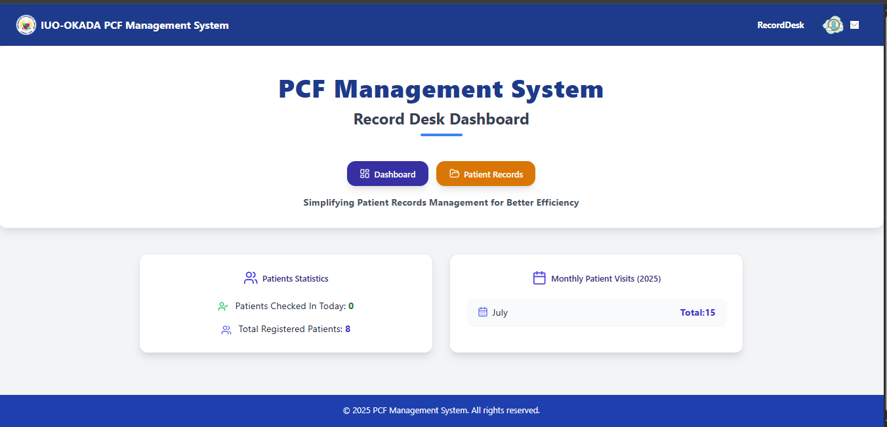
  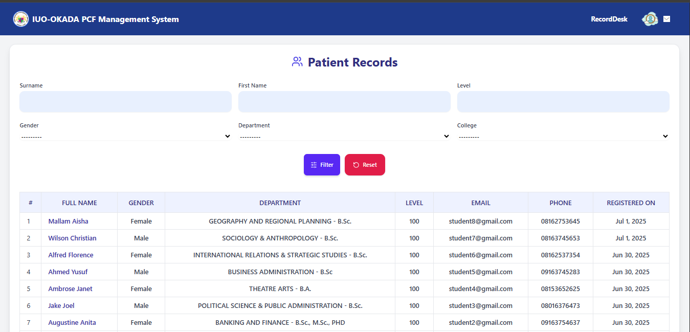
  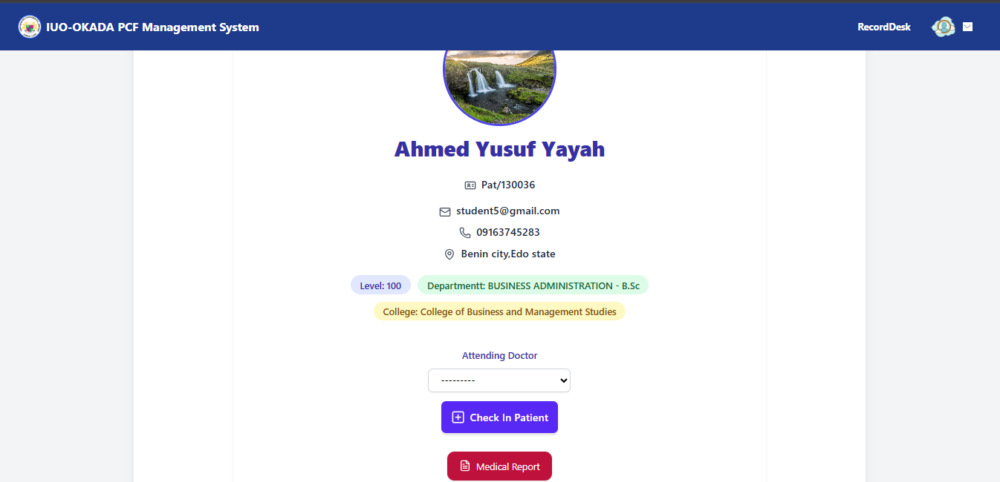

  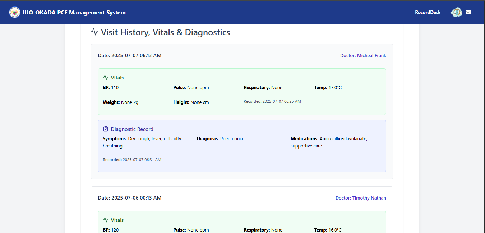
  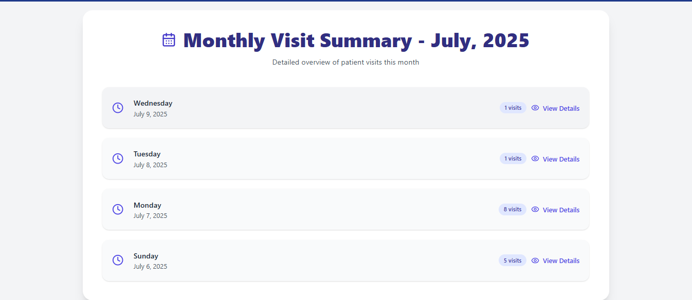
  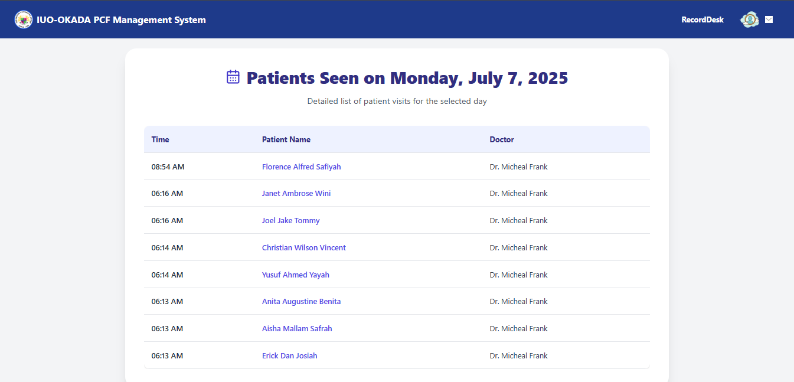

  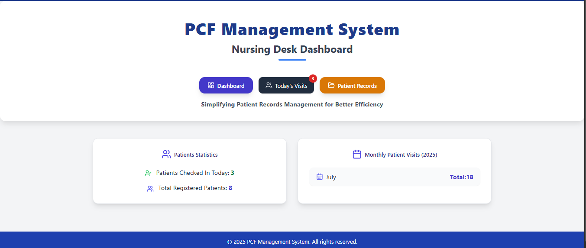
  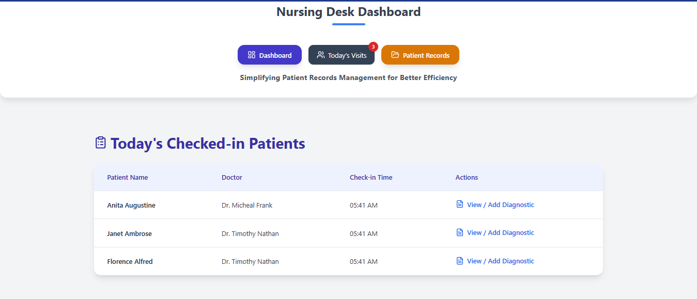
  

  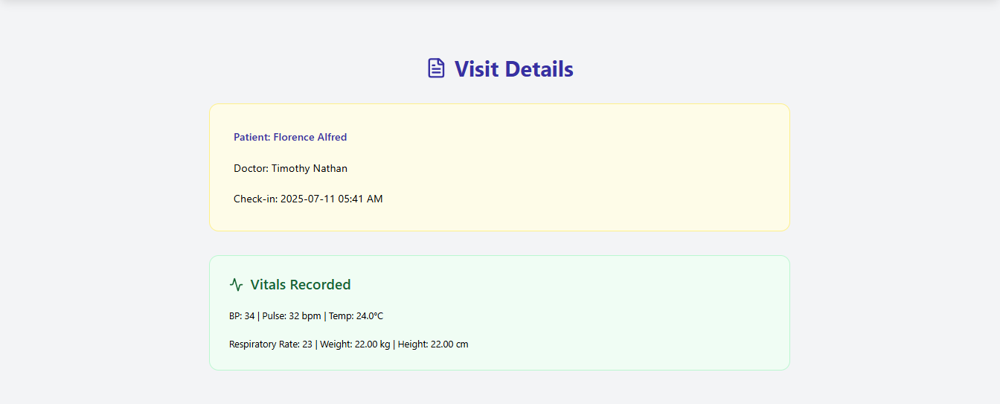
  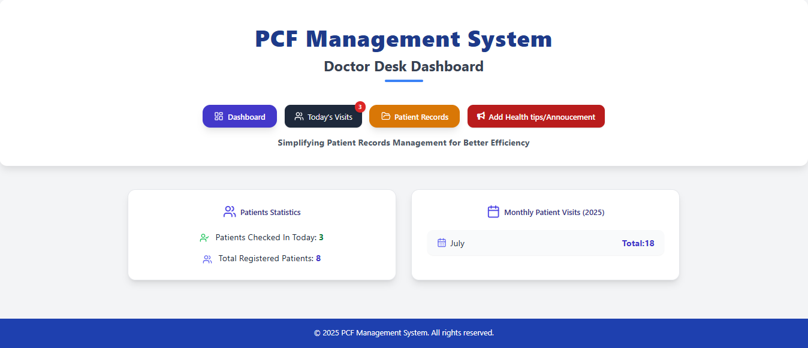
  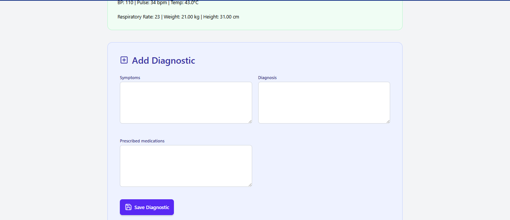

---

---

## 🤝 Let’s Collaborate

Interested in using or customizing this system for your institution?

📧 Reach out at **tariofiyoushell@gmail.com**  
📱 Call/WhatsApp: **+234 702 610 8529**  
🌐 [View Portfolio](https://legacy5234.github.io/My-Portfolio/)  
🐙 [GitHub](https://github.com/Legacy5234)

---

